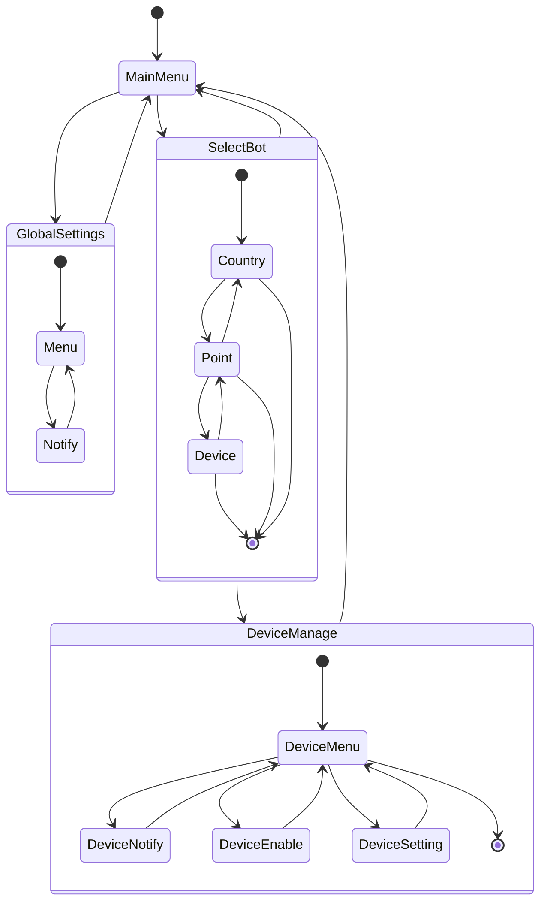

# Unit Watch Bot
## Finite State Machine

```mermaid
stateDiagram-v2
    [*]-->MainMenu
    MainMenu-->GlobalSettings
    GlobalSettings-->MainMenu
    SelectBot-->MainMenu
    MainMenu-->SelectBot
    SelectBot-->DeviceManage
    DeviceManage-->MainMenu
%%    BotManage-->BotSetting
%%    BotSetting-->BotManage
    
    state SelectBot {
        [*]-->Country
        Country-->Point
        Point-->Country
        Point-->Device
        Device-->Point
        Device-->[*]
        Point-->[*]
        Country-->[*]
    }

    state DeviceManage {
        [*]-->DeviceMenu
        DeviceMenu-->DeviceNotify
        DeviceNotify-->DeviceMenu
        DeviceMenu-->DeviceEnable
        DeviceEnable-->DeviceMenu
        DeviceMenu-->DeviceSetting
        DeviceSetting-->DeviceMenu
        DeviceMenu-->[*]
    }

    state GlobalSettings {
        [*]-->Menu
        Menu-->Notify
        Notify-->Menu
    }

```